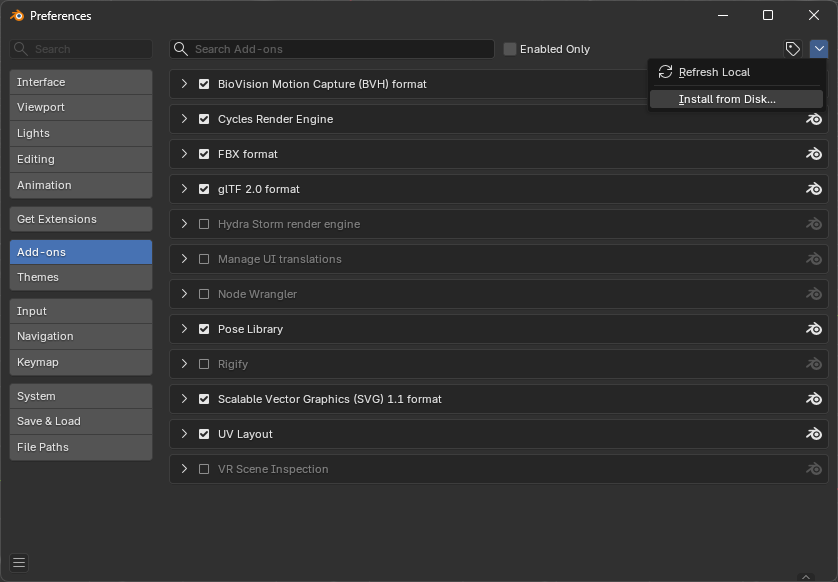
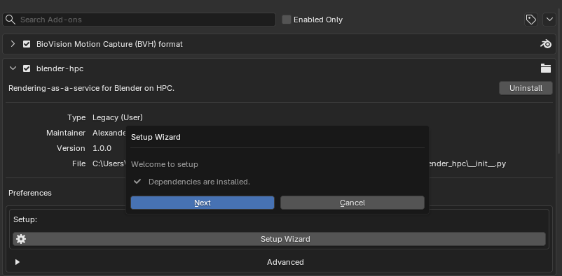
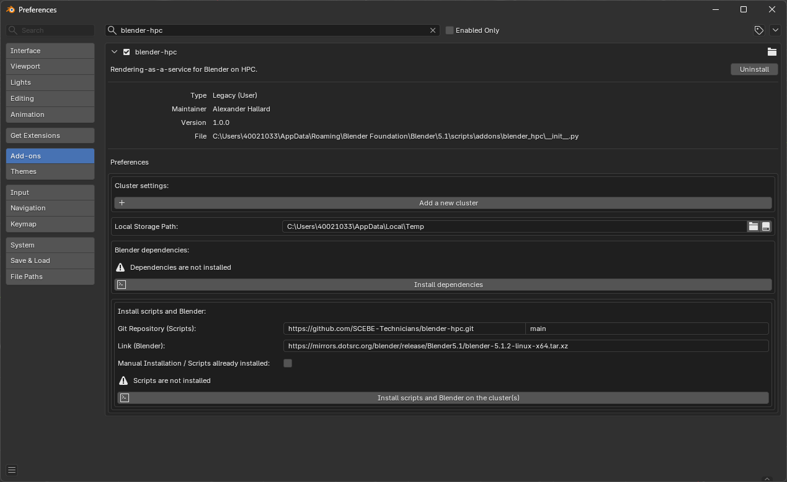
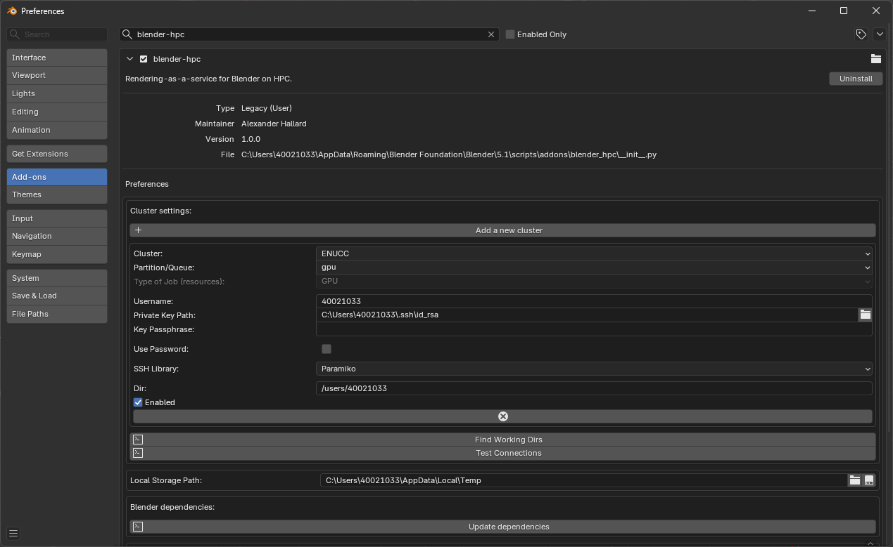
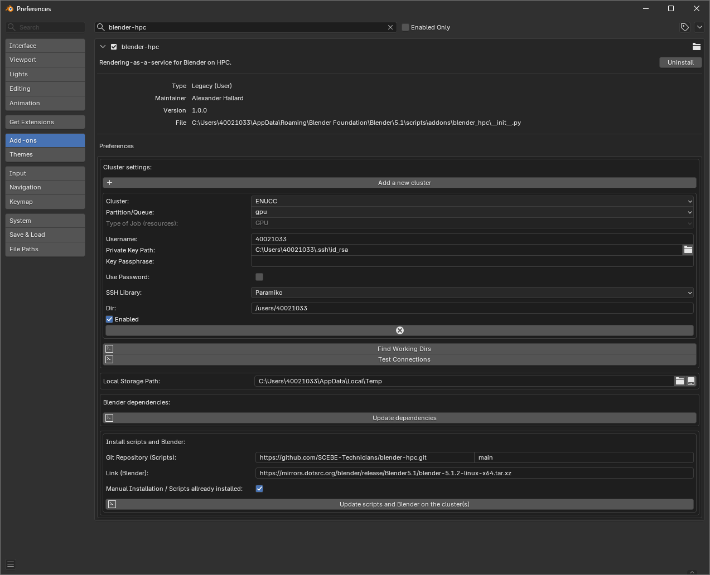
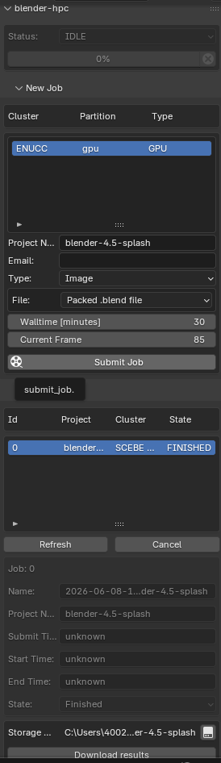

---

# Using Blender with ENUCC

## Description

The [blender-hpc add-on](https://github.com/SCEBE-Technicians/blender-hpc) lets you submit Blender render jobs from your local Blender session to ENUCC.

---

## Prerequisites

Before using the add-on you should:

* Have an ENUCC account
* Have Blender installed on your local computer
* Be able to connect to ENUCC using SSH

You can connect using either an SSH key or your ENUCC password. SSH keys are usually more convenient. If you have not used SSH keys before, see the [SSH key generation guide](../useful-extras/ssh-keygen.md).

---

## Installation

### Downloading the Add-on

Download the latest add-on ZIP file from the releases page:

[Download blender-hpc.zip](https://github.com/SCEBE-Technicians/blender-hpc/releases/download/main-latest/blender-hpc.zip)

Keep the downloaded ZIP file somewhere you can find it from Blender.

---

### Installing the Add-on in Blender

Open Blender, then go to:

```text
Edit > Preferences > Add-ons
```

Open the add-ons menu in the top-right corner and select **Install from Disk...**.



Select the downloaded `blender-hpc` ZIP file.

After installation, search for:

```text
blender-hpc
```

Enable the add-on using the checkbox next to its name.

---

### Following the Setup Wizard

After enabling the add-on, follow the setup wizard.



!!! warning

    Blender may stop responding while dependencies or scripts are installed. This is expected. Wait for the setup wizard to finish before closing Blender.
    

<details markdown="1">
<summary>Configure Advanced preferences</summary>

**Initial Preferences**

After enabling the add-on, the preferences panel should show the `blender-hpc` settings.

At first, the cluster settings, Blender dependencies, and cluster scripts may not yet be configured.



The preferences contain three main areas:

* Cluster settings
* Local Blender dependencies
* Scripts and Blender installation on the cluster

---

**Installing Dependencies**

The add-on uses local dependencies to communicate with ENUCC. Install these before setting up the cluster connection.

In the **Blender dependencies** section, press:

```text
Install dependencies
```

!!! warning

    Blender may stop responding while the dependencies are being installed. This is expected. Wait for the installation to finish ~1 minute.


---

**Adding ENUCC as a Cluster**

In the **Cluster settings** section, press **Add a new cluster**.

Use the following settings:

```text
Cluster: ENUCC
Partition/Queue: gpu
Dir: /users/your-username
Enabled: checked
```

You can also use **Find Working Dirs** to check which remote directories are available.

If you are using an SSH key, set **Private Key Path** to the path of your local private key.

If you are using your ENUCC password, enable **Use Password** and enter your password in the password field.

For example, if your ENUCC username is `40021033`, the remote directory would usually be:

```text
/users/40021033
```

If you are using an SSH key, the private key is normally stored on your local computer. On Windows it is commonly in:

```text
C:\Users\your-username\.ssh\id_rsa
```

After entering the details, use **Test Connections** to check that Blender can connect to ENUCC.




---

**Installing Scripts and Blender on ENUCC**

The add-on also needs supporting scripts, and a Blender installation, to be available on ENUCC.

In the **Install scripts and Blender** section press:

```text
Install scripts and Blender on the cluster(s)
```

If the scripts have already been installed, select **Manual Installation / Scripts already installed**



</details>

---

## Usage

### Submitting a Render Job

Once the add-on is configured, open the Blender render tab then select Render Engine **Cycles** find the `blender-hpc` tab in the side panel.

In the **New Job** section:

1. Select the ENUCC cluster entry.
2. Set the walltime in minutes. (Max time)
3. Choose the frame or animation settings.
4. Press **Submit Job**.


When the job is submitted, it will appear in the job list.

---

### Checking and Downloading Results

Use **Refresh** to update the job list.

When the job has completed, its state should show as:

```text
FINISHED
```

Select the job and use **Download results** to copy the rendered output back to your local computer then select the file explorer icon to view output.



---

## Troubleshooting

### The Add-on Cannot Connect to ENUCC

Check that:

* Your username is correct
* If using an SSH key, the private key path points to the correct local SSH key
* If using password authentication, **Use Password** is enabled
* Your SSH key or password works outside Blender using a normal SSH connection
* The cluster entry is enabled

### Dependencies Are Not Installed

Return to:

```text
Edit > Preferences > Add-ons > blender-hpc
```

Then use **Install dependencies** or **Update dependencies**.

### Scripts Are Not Installed on ENUCC

Return to the add-on preferences and use:

```text
Install scripts and Blender on the cluster(s)
```

If you have already installed the scripts manually, enable **Manual Installation / Scripts already installed**.

### Jobs Stay Queued

If the GPU partition is busy, your job may wait in the queue before starting.

---
