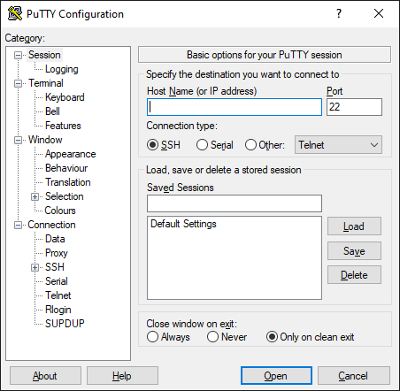
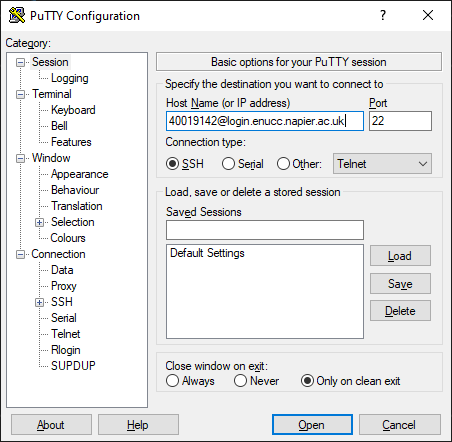
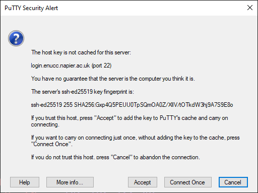
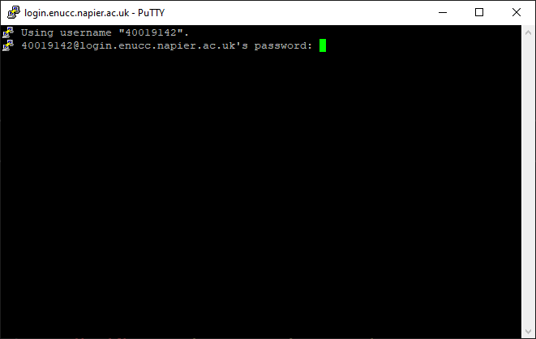
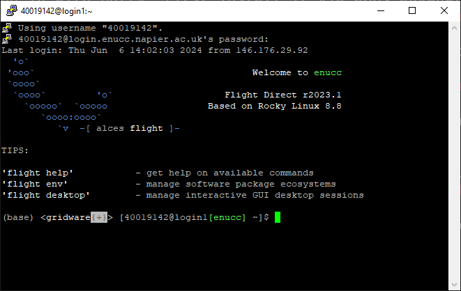

# Logging in with PuTTY

To log in with putty, first install it via apps anywhere. When you launch the application it should look like so:

Into the input box labelled Host Name (or IP address) type `4XXXXXXX@login.enucc.napier.ac.uk`, replacing the X's with your staff or student number.

The first time you do this, you'll be presented with the following warning. Press accept.

You'll then be prompted to type in your password. Nothing will show on screen as you type, this is normal.

Press enter, and you're now connected to a bash shell on the login node.

