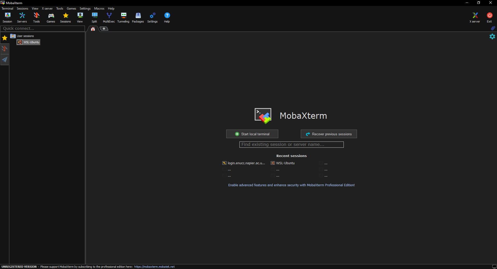
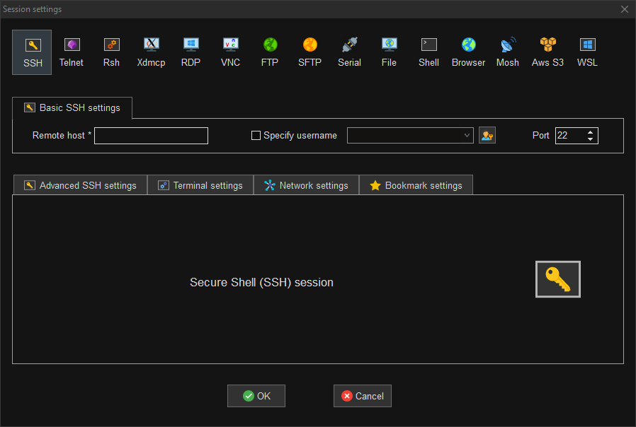
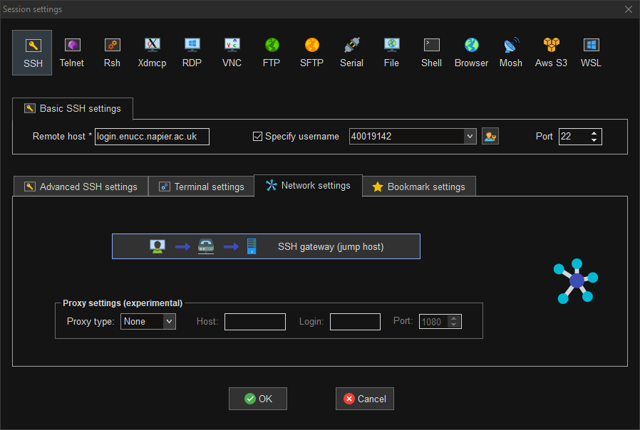
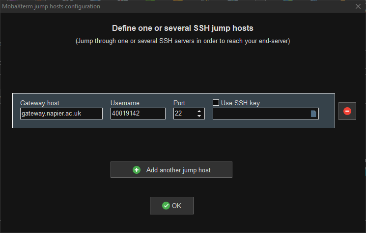
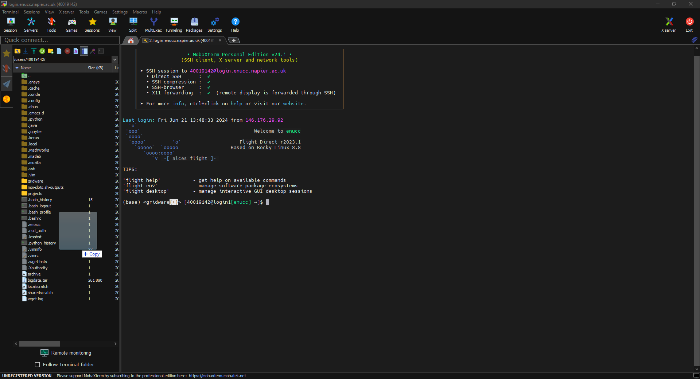

# Using MobaXTerm

MobaXTerm is a feature rich terminal emulator which runs on windows. You can download it from the [official website](https://mobaxterm.mobatek.net/).

To access ENUCC with MobaXTerm, first open the program.

In the top right press the session button.

Select SSH and fill out the host and username fields. For the Remote host you should type `login.enucc.napier.ac.uk`. Check the box which says "Specify username" then type in your staff or student number as the username.

If you are accessing ENUCC from within the university then you can press OK and type in your password when prompted.

If you are accessing from outside the university you'll need to use the SSH gateway. Navigate to the Network settings tab and click on the button which says "SSH gateway (jump host).

For the Gateway host field put `gateway.napier.ac.uk`. For the username put your staff or student number. Press OK once those are filled out.

Once you're connected, you'll see a filetree on the left hand side of the screen. You can upload files from your local computer to ENUCC by dragging them into this box.

