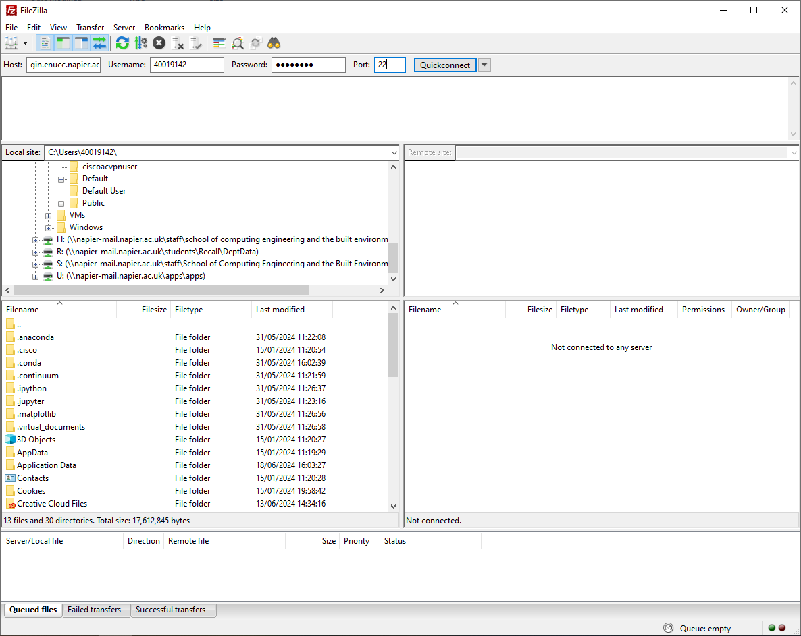
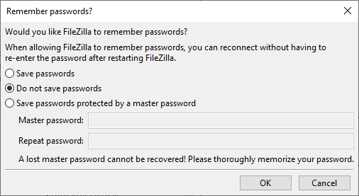
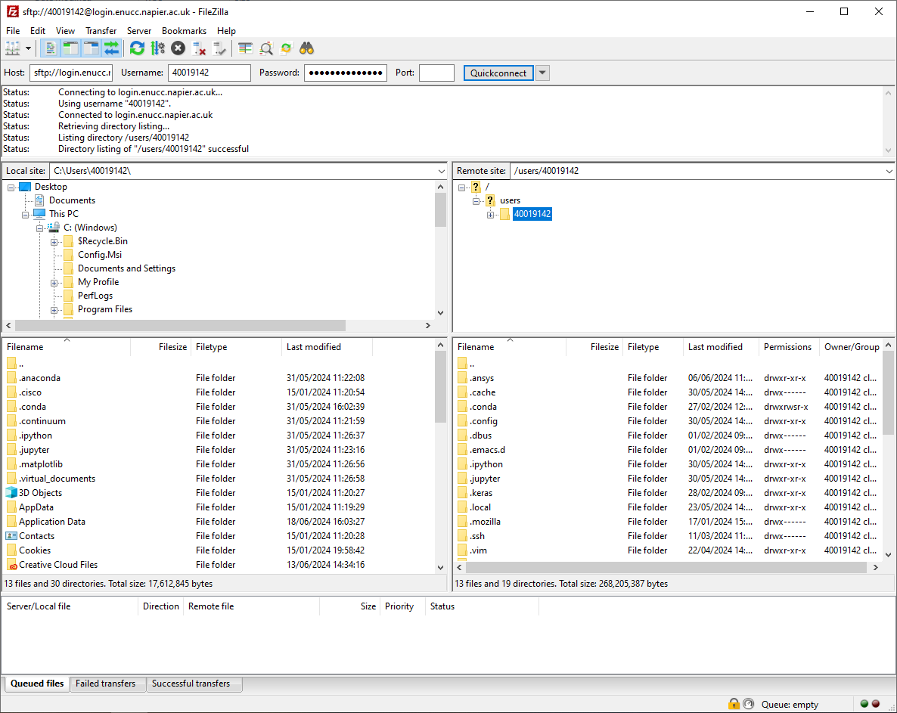
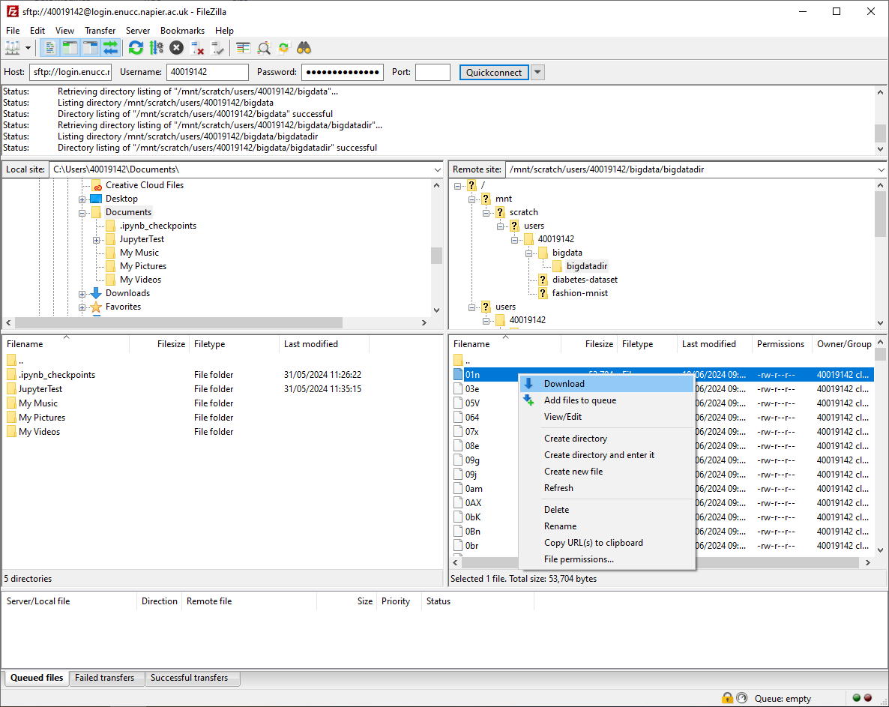
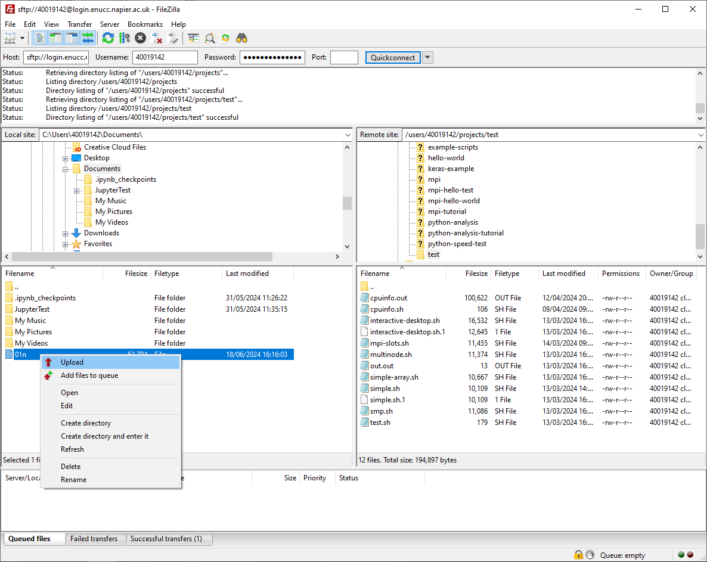

#Using FileZilla

Filezilla is a program which allows you to easily move files between your local machine and a remote server (ENUCC in this case). If you have a managed machine you can download FileZilla from [AppsAnywhere](https://apps.napier.ac.uk/). Otherwise you can download the FileZilla **client** from the [website](https://filezilla-project.org/).

When you open FileZilla you'll see the following screen.

At the top of the screen you'll see a few fields which you can fill in. For the Host you'll want to put `login.enucc.napier.ac.uk`. For username you'll need to put your university staff or student number, `4XXXXXXX`. For the password, you'll type in your usual password. Finally for the port you'll need to put `22`.

You will get a popup which asks whether you want FileZilla to remember your password. I personally would advise against it, but you can decide for yourself.

Once you're connected, you'll see your local filesystem in the two boxes on the left hand side and the ENUCC filesystem on the right hand side.

To download a file from ENUCC to your local machine, navigate to the file on ENUCC that you want to download. On the left hand side navigate to the location that you want the file to be downloaded to. In order to download the file, you simple right click the file and select download.

Uploading works in exactly the same way except that you select a file on your local machine on the left hand side. Right click the file and press upload.

## Uploading through the SSH Gateway

If you are not connected to a university network then uploading and downloading files can be a bit more complicated. Instructions to follow soon...
